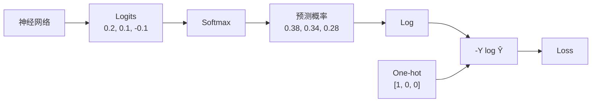

# CrossEntropyLoss

```mermaid
flowchart LR
    A["神经网络"]
    B["Logits<br/>0.2, 0.1, -0.1"]
    C["Softmax"]
    D["预测概率<br/>0.38, 0.34, 0.28"]
    E["Log"]
    F["One-hot<br/>[1, 0, 0]"]
    G["-Y log Ŷ"]
    H["Loss"]

    A --> B
    B --> C
    C --> D
    D --> E
    E --> G
    F --> G
    G --> H
```